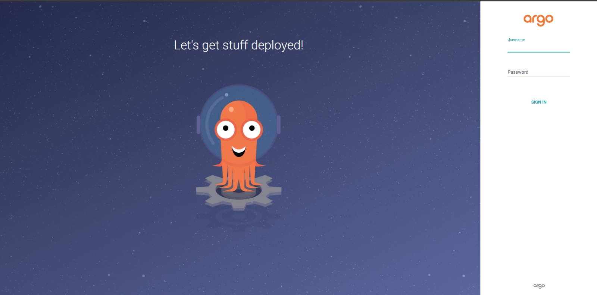
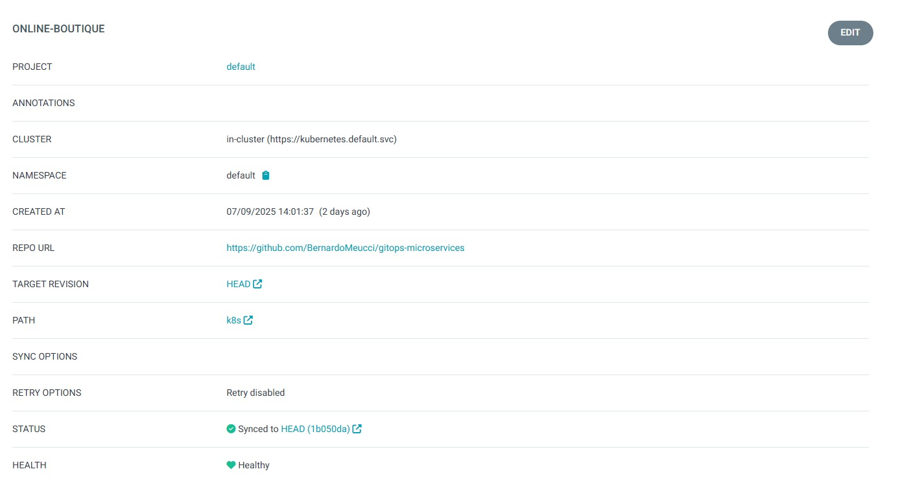
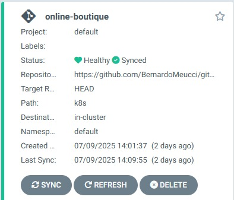
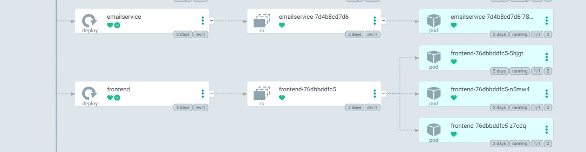
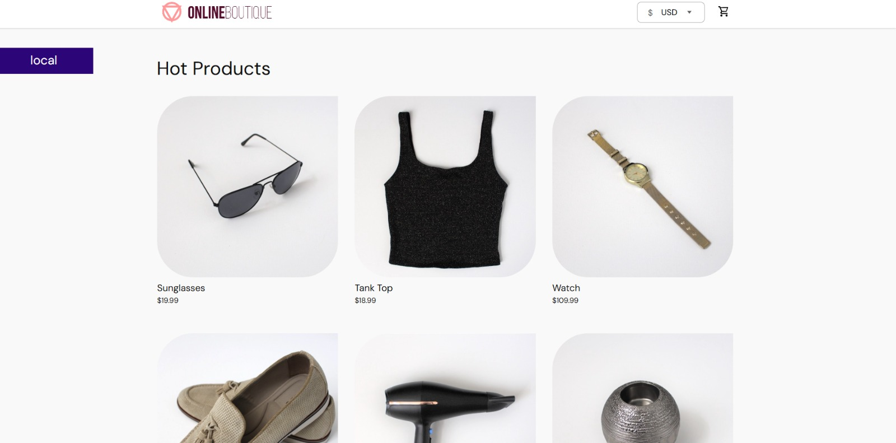

# 🚀 Projeto: GitOps na Prática com Kubernetes e ArgoCD


Este repositório contém os manifestos Kubernetes para a aplicação de microserviços **Online Boutique**, implantada e gerenciada através de uma esteira de GitOps.

O projeto foi desenvolvido como parte do **Programa de Bolsas - DevSecOps da Compass UOL** e demonstra na prática como as empresas modernas operam em ambientes cloud-native para realizar entregas rápidas, seguras e escaláveis.

---

## 🎯 Objetivo do Projeto

Executar o conjunto de microserviços **Online Boutique** em um cluster Kubernetes local, controlado por práticas de GitOps com **ArgoCD**, a partir deste repositório público no GitHub.

---

## 🛠️ Tecnologias e Conceitos

| Tecnologia / Conceito | Propósito no Projeto |
| :-------------------- | :--------------------------------------------------------------------------------------------------------------------------------------------- |
| **Kubernetes** | Plataforma de orquestração de contêineres que serviu como base para rodar a aplicação em um ambiente local via **Docker Desktop**.                  |
| **GitOps** | Metodologia de operações onde o repositório Git é a **fonte única da verdade**, garantindo um processo de deploy auditável e previsível.        |
| **ArgoCD** | Ferramenta de GitOps que atua como um operador no cluster, garantindo que o estado da aplicação seja um reflexo fiel do que está definido no Git. |
| **Microserviços** | Arquitetura da aplicação de exemplo ("Online Boutique"), dividida em múltiplos serviços independentes e conteinerizados.                       |
| **Docker** | Utilizado como o motor de contêineres que executa as imagens da aplicação dentro dos pods do Kubernetes.                                       |

---

## ✅ Resumo da Execução

<details>
<summary><strong>Clique para ver o passo a passo da execução do projeto</strong></summary>

### 1. Configuração do Ambiente
   - Um cluster Kubernetes foi inicializado localmente utilizando o **Docker Desktop**.
   - O `kubectl` foi configurado para se comunicar com o cluster.

### 2. Criação da Fonte da Verdade
   - Este repositório Git foi criado para hospedar os manifestos da aplicação.
   - O manifesto da aplicação "Online Boutique" foi adicionado à pasta `k8s/`.

### 3. Instalação e Configuração do ArgoCD
   - O ArgoCD foi instalado no cluster através do comando `kubectl apply`.
   - O acesso à sua interface gráfica foi liberado localmente via `port-forward`, disponibilizando a tela de login.

<p align="center">
  
</p>

### 4. Deploy Automatizado via GitOps
   - Um "App" foi criado no ArgoCD, conectando este repositório ao cluster local. A imagem abaixo mostra os parâmetros exatos utilizados para esta configuração.

<p align="center">
  
</p>

   - Ao estabelecer a conexão, o ArgoCD iniciou a sincronização automática, resultando no status `Healthy` e `Synced`, como visto no card da aplicação:

<p align="center">
  
</p>

### 5. Escalabilidade (Etapa Opcional)
   - Para demonstrar o poder do GitOps, o `Deployment` do `frontend` foi customizado e escalado para **3 réplicas**.
   - A mudança foi feita no arquivo YAML, enviada ao Git, e o ArgoCD automaticamente ajustou o número de pods no cluster, como pode ser visto na árvore de componentes.

<p align="center">
  
</p>

</details>

---

## 🖥️ Como Visualizar o Resultado

Com o ambiente em execução, a aplicação final pode ser acessada da seguinte forma:

1.  **Ativar o túnel de acesso para a aplicação:**
    ```bash
    kubectl port-forward svc/frontend-external -n default 8081:80
    ```

2.  **Acessar a loja online no navegador:**
    - URL: `http://localhost:8081`

<p align="center">
  
</p>